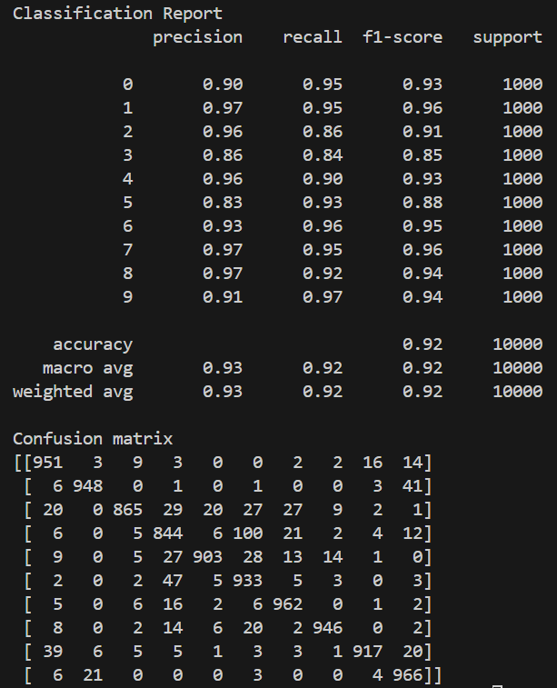

# ResNetTransfer

From following the tutorial at: https://medium.com/@paravisionlab/supercharge-your-ai-resnet50-transfer-learning-unleashed-b7c0e40976c4

The tutorial shows how to retrain the top layers of the ResNet50 model (transfer learning). The original model is trained on the ImageNet dataset that has 1000 output classes but the retraining allows it to predict the 10 output classes of the CIFAR-10 dataset. 

## Results
The result are pretty good with an average precision of 93% and the Confusion Matrix has relatively high values on the diagonal.

## Restore
1. Make sure you have Miniconda installed: https://www.anaconda.com/docs/getting-started/miniconda/install
1. Setup the environment: `conda env create -f environment.yml`
1. Activate the environment: `conda activate ResNetTransfer`

## Run
### Train
* Run: `python main.py`

### Predict and Evaluate on Test Data
* Run: `python predict.py`

### Predict and Show a Single Image
* Run: `python predict_single_img.py`

## Enable GPU
Creating the environment from `environment.yml` should mean that this isn't necessary but for reference:
1. `pip install tensorflow==2.10.0` # last version that supports Windows
1. `conda install cudatoolkit=11.2 cudnn=8.1 -c=conda-forge`
1. `pip install --upgrade tensorflow-gpu==2.10.0`

https://stackoverflow.com/a/78351204
